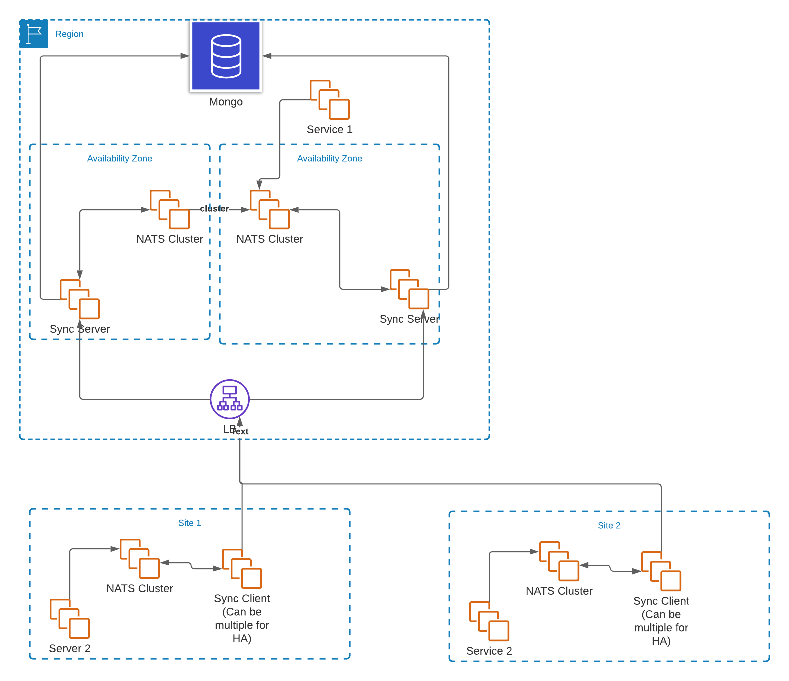

# General Design Notes

# Design

## Big Parts

The system is a pretty standard piece of client/server software

We have the bridge client which runs on prem to grab south bound messages from the bridge server.

Cloud Server runs on the North Bound side (cloud side) and listens for messages on a NATS system that are meant to go to
the client side (Based on subject)

The client connects to the servers, ask for any messages for the client, it downloads them and puts them onto the NATS
queue locally. The client also pushes any messages going north bound.

Most classes are under pkg.

Main packages

* bridgeclient - Classes for the client (south) side of the communication
* bridgeserver - classes for the bridge (north) side of the communications
* metrics - has open metrics classes
* bridgemodel - the glue that binds client and bridge server
* msgs - Classes for storing and encrypting messages

## Plugable Parts

* The msgs packages has a key store interface. We have a file based (no good for HA, but maybe fine for the client)  and
  a Mongo key store

# Message Convention

As a general rule there are no requirements on messages. They are passed as is. They are encrypted, but when they arrive
at the NATS Message Server they are normal NATS messages.

1 Small item, Subject Names

Subject names are used for routing. So they must have some basic form. Messages to the client side (aka south side) must
be prepended with natssync-sb

Messages coming back to the server (aka cloud side or north side) must be prepended with natssync-nb Then the location
ID (on premise ID or the cloud server ID) must follow then the application specific data

General for is:

natssync-(sb|nb).locationID.application-specific-data

# Registration of Cloud Clients

To have messages delivered to a client, the cloud server must know about the client. Specifically the server needs to
generate a location ID (aka premID or client ID) for the client and the client needs to give the server its public key
for message exchange.

The bridge server has a REST API that the client uses. However to use the REST API, the auth token for the request must
be authenticated and authorized.

The way the server does this is by posting an auth request message on the server side NATS queue.

The subject to listen for is `natssync.regauth.request`

The message is a JSON package in this format:

`
{

    "authToken":"some token",
    "locationID":"some id string"
    
}
`

The return message has a single field
`
{

    success: true | false

}
`

This allows the user to deploy a customer or one of the pre-canned auth servers.  
The docker hub container theotw/simple-reg-auth is available for use

Registration Process:

# Examples

Look at the echo_client and echo_main in apps for examples